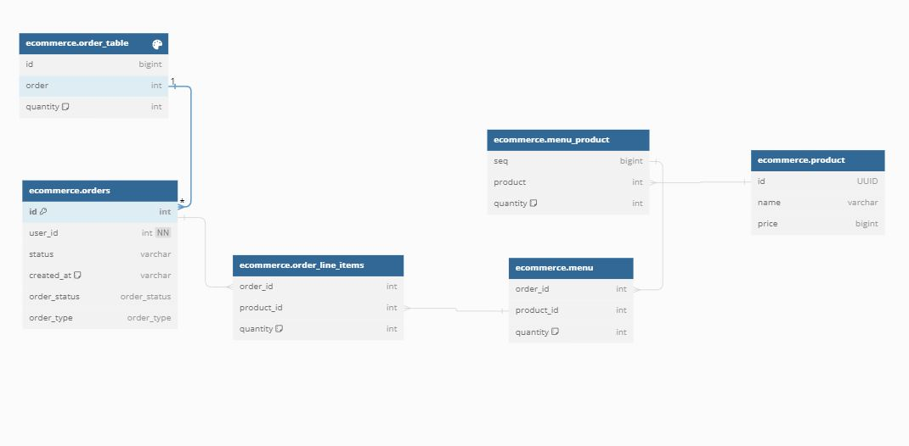
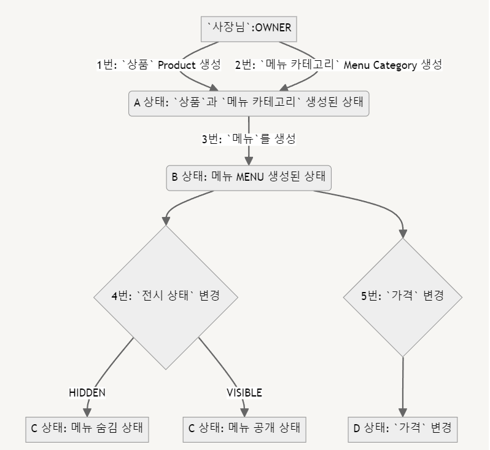
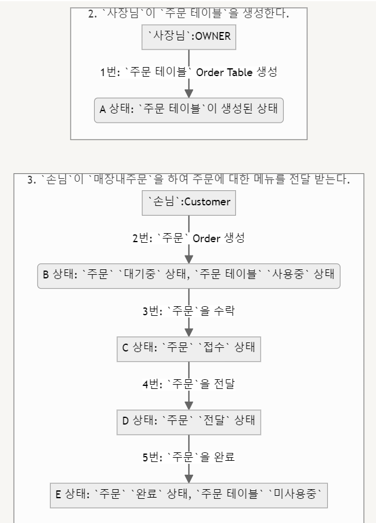
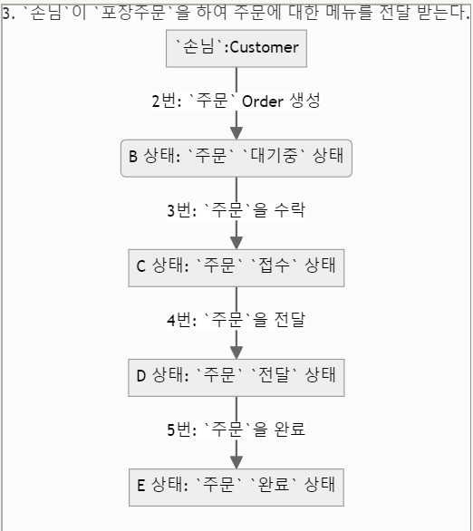
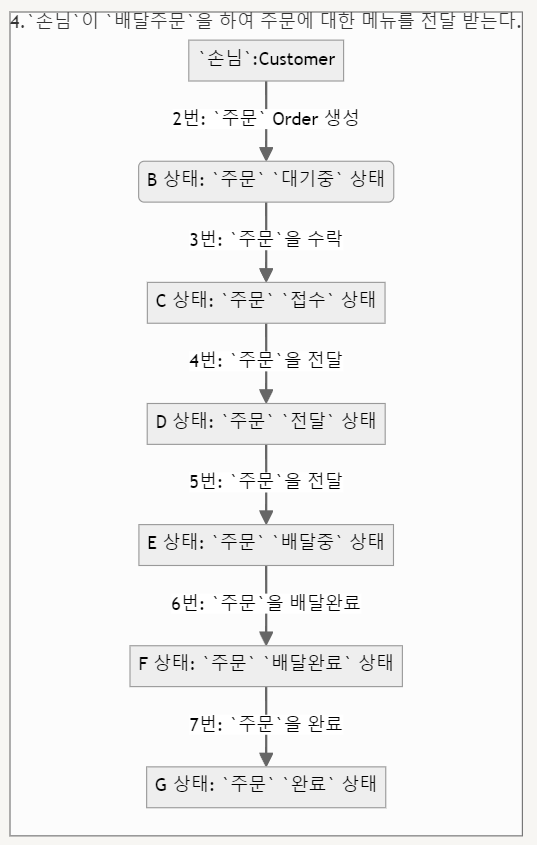

# 키친포스

## 퀵 스타트

```sh
cd docker
docker compose -p kitchenpos up -d
```

## 요구 사항

### 상품

- 상품을 등록할 수 있다.
- 상품의 가격이 올바르지 않으면 등록할 수 없다.
    - 상품의 가격은 0원 이상이어야 한다.
- 상품의 이름이 올바르지 않으면 등록할 수 없다.
    - 상품의 이름에는 비속어가 포함될 수 없다.
- 상품의 가격을 변경할 수 있다.
- 상품의 가격이 올바르지 않으면 변경할 수 없다.
    - 상품의 가격은 0원 이상이어야 한다.
- 상품의 가격이 변경될 때 메뉴의 가격이 메뉴에 속한 상품 금액의 합보다 크면 메뉴가 숨겨진다.
- 상품의 목록을 조회할 수 있다.

### 메뉴 그룹

- 메뉴 그룹을 등록할 수 있다.
- 메뉴 그룹의 이름이 올바르지 않으면 등록할 수 없다.
    - 메뉴 그룹의 이름은 비워 둘 수 없다.
- 메뉴 그룹의 목록을 조회할 수 있다.

### 메뉴

- 1 개 이상의 등록된 상품으로 메뉴를 등록할 수 있다.
- 상품이 없으면 등록할 수 없다.
- 메뉴에 속한 상품의 수량은 0 이상이어야 한다.
- 메뉴의 가격이 올바르지 않으면 등록할 수 없다.
    - 메뉴의 가격은 0원 이상이어야 한다.
- 메뉴에 속한 상품 금액의 합은 메뉴의 가격보다 크거나 같아야 한다.
- 메뉴는 특정 메뉴 그룹에 속해야 한다.
- 메뉴의 이름이 올바르지 않으면 등록할 수 없다.
    - 메뉴의 이름에는 비속어가 포함될 수 없다.
- 메뉴의 가격을 변경할 수 있다.
- 메뉴의 가격이 올바르지 않으면 변경할 수 없다.
    - 메뉴의 가격은 0원 이상이어야 한다.
- 메뉴에 속한 상품 금액의 합은 메뉴의 가격보다 크거나 같아야 한다.
- 메뉴를 노출할 수 있다.
- 메뉴의 가격이 메뉴에 속한 상품 금액의 합보다 높을 경우 메뉴를 노출할 수 없다.
- 메뉴를 숨길 수 있다.
- 메뉴의 목록을 조회할 수 있다.

### 주문 테이블

- 주문 테이블을 등록할 수 있다.
- 주문 테이블의 이름이 올바르지 않으면 등록할 수 없다.
    - 주문 테이블의 이름은 비워 둘 수 없다.
- 빈 테이블을 해지할 수 있다.
- 빈 테이블로 설정할 수 있다.
- 완료되지 않은 주문이 있는 주문 테이블은 빈 테이블로 설정할 수 없다.
- 방문한 손님 수를 변경할 수 있다.
- 방문한 손님 수가 올바르지 않으면 변경할 수 없다.
    - 방문한 손님 수는 0 이상이어야 한다.
- 빈 테이블은 방문한 손님 수를 변경할 수 없다.
- 주문 테이블의 목록을 조회할 수 있다.

### 주문

- 1개 이상의 등록된 메뉴로 배달 주문을 등록할 수 있다.
- 1개 이상의 등록된 메뉴로 포장 주문을 등록할 수 있다.
- 1개 이상의 등록된 메뉴로 매장 주문을 등록할 수 있다.
- 주문 유형이 올바르지 않으면 등록할 수 없다.
- 메뉴가 없으면 등록할 수 없다.
- 매장 주문은 주문 항목의 수량이 0 미만일 수 있다.
- 매장 주문을 제외한 주문의 경우 주문 항목의 수량은 0 이상이어야 한다.
- 배달 주소가 올바르지 않으면 배달 주문을 등록할 수 없다.
    - 배달 주소는 비워 둘 수 없다.
- 빈 테이블에는 매장 주문을 등록할 수 없다.
- 숨겨진 메뉴는 주문할 수 없다.
- 주문한 메뉴의 가격은 실제 메뉴 가격과 일치해야 한다.
- 주문을 접수한다.
- 접수 대기 중인 주문만 접수할 수 있다.
- 배달 주문을 접수되면 배달 대행사를 호출한다.
- 주문을 서빙한다.
- 접수된 주문만 서빙할 수 있다.
- 주문을 배달한다.
- 배달 주문만 배달할 수 있다.
- 서빙된 주문만 배달할 수 있다.
- 주문을 배달 완료한다.
- 배달 중인 주문만 배달 완료할 수 있다.
- 주문을 완료한다.
- 배달 주문의 경우 배달 완료된 주문만 완료할 수 있다.
- 포장 및 매장 주문의 경우 서빙된 주문만 완료할 수 있다.
- 주문 테이블의 모든 매장 주문이 완료되면 빈 테이블로 설정한다.
- 완료되지 않은 매장 주문이 있는 주문 테이블은 빈 테이블로 설정하지 않는다.
- 주문 목록을 조회할 수 있다.

## 용어사전

### 공통
| 한글명 | 영문명        | 설명                         |
|-----|------------|----------------------------|
| 사장님 | Owner      | 키친포스를 이용하는 사용자             |
| 손님  | Customer   | 주문을 생성해서 사장님에게 전달하는 간접사용자  |
| 라이더 | Rider      | 호출받고 주문장소로 배달을 전달하는 간접사용자  |
| 식당  | Restaurant | 사장님이 키친포스를 사용하는 장소         |


### 메뉴 카테고리

| 한글명        | 영문명                | 설명                                       |
|------------|--------------------|------------------------------------------|
| 메뉴 카테고리    | Menu Category      | 메뉴들의 집합 (ex: '추천메뉴', '신메뉴', '2명을 위한 메뉴') |
| 메뉴 카테고리 이름 | Menu Category Name | 손님들에게 보여지는 메뉴들의 집합의 명칭                   |

### 상품
| 한글명 | 영문명           | 설명                                                             |
|-----|---------------|----------------------------------------------------------------|
| 상품  | Product       | 사장님이 판매하고자하는 재화 (사장님에게만 조회가능하다.) (ex: '프라이드 치킨', '옥수수튀김', '회전회오리 튀김') |
| 비속어 | Profanity     | 법적문제의 소지를 가진 언어군을 통칭                                           |
| 가격  | Product Price | 재화의 가치, KRW(원화로 표기한다)                                          |

### 메뉴
| 한글명      | 영문명                   | 설명                                                                                |
|----------|-----------------------|-----------------------------------------------------------------------------------|
| 메뉴       | Menu                  | 손님들에게 판매되는 상품들의 집합 (손님들의 주문 하는 단위) (ex: '프라이드 치킨2마리', '프라이드치킨 + 치즈볼', '불고기버거 세트') |
| 메뉴 구성 상품 | Menu Product          | 상품 중 메뉴에 포함된 상품                                                                   |
| 메뉴 상품 개수 | Menu Product Quantity | 메뉴 구성 상품의 갯수                                                                      |
| 메뉴 가격    | Menu Price            | 메뉴의 판매하고자 하는 가치, KRW(원화로 표기한다)                                                    |
| 메뉴 이름    | Menu Name             | 상품들의 집합의 명칭                                                                       |
| 메뉴 전시 상태 | Menu Display Status   | 메뉴들이 손님들이 볼 수 있는지에 대한 상태                                                          |


### 메뉴 전시 상태
| 한글명    | 영문명                 | 설명                       |
|--------|---------------------|--------------------------|
| 메뉴 전시 상태 | Menu Display Status | 메뉴들이 손님들이 볼 수 있는지에 대한 상태 |
| 공개 상태  | Visible             | 메뉴들이 손님들이 볼 수 있는 상태      |
| 숨김 상태  | Hide                | 메뉴들이 손님들이 볼 수 없는 상태      |

### 주문
| 한글명   | 영문명              | 설명                                  |
|-------|------------------|-------------------------------------|
| 주문    | Order            | 손님이 메뉴에 대해 대접 혹은 배달 혹은 전달을 요구하는 행위  |
| 주문 종류 | Order Category   | 주문 가능한 유형                           |
| 주문 상태 | Order Status     | 주문의 생애주기(생성 부터 완료)를 나타내는 상태         |
| 배달 장소 | Delivery Address | 배달 주문의 경우, 필수적으로 필요한 손님이 전달을 요청한 장소 |

### 주문 행위
| 한글명 | 영문명        | 설명                          |
|-------|------------------|-----------------------------|
| 대접  | Serving    | 상품을 식당 내에서 손님이 제공하는 행위      |
| 배달  | Delivery   | 라이더가 배달장소로 손님에게 전달하는 행위     |
| 수락  | Accept     | 사장님이 주문에 대한 상품 생산을 시작하는 행위  |
| 전달  | PassingOn     | 한 주체로부터 다른 주체에게 상품을 전달하는 행위 |

### 주문 상태
| 한글명   | 영문명          | 설명                       |
|-------|--------------|--------------------------|
| 주문 상태 | Order Status | 주문의 상태                   |
| 대기중   | WAITING      | 주문 생성 시 접수 대기 상태         |
| 접수    | ACCEPTED     | 사장님이 주문을 수락 시의 상태        |
| 전달    | SERVED       | 주문을 손님 혹은 라이더에게 전달 시의 상태 |
| 배달중   | DELIVERING   | 라이더에게 전달 완료 상태           |
| 배달완료  | DELIVERED    | 라이더가 배달 완료 상태            |
| 주문완료  | COMPLETED    | 주문이 완료됐을때의 설정            |


### 주문 종류
| 한글명   | 영문명            | 설명                                         |
|-------|----------------|--------------------------------------------|
| 주문 종류 | Order Category | 주문 가능한 유형                                  |
| 배달주문  | DELIVERY       | 주문 장소로 배달하는 주문 (필수로 주문 장소를 가져야 한다.)        |
| 포장주문  | TAKEOUT        | 손님이 매장에서 가져가는 주문                           |
| 매장내주문 | EAT_IN         | 손님이 주문 테이블에서 식사하는 주문 (필수로 주문 테이블을 가져야 한다.) |

### 주문 테이블
| 한글명       | 영문명                | 설명                          |
|-----------|--------------------|-----------------------------|
| 주문 테이블    | Order Table        | 식당 내에서 주문에 대한 메뉴가 대접받는 장소   |
| 고객 인원     | Customer Headcount | 주문 테이블에서 대접받고 있는 손님의 수      |
| 주문 테이블 상태 | Order Table Status | 주문 테이블이 주문을 받을 수 있는지에 대한 정보 |

### 주문 테이블 상태
| 한글명       | 영문명                | 설명                          |
|-----------|--------------------|-----------------------------|
| 주문 테이블 상태 | Order Table Status | 주문 테이블이 주문을 받을 수 있는지에 대한 정보 |
| 사용중       | OCCUPIED           | 주문 테이블이 손님들이 사용 중 상태        |
| 미사용중      | UNOCCUPIED         | 주문 테이블이 손님들이 사용 중이 아닌 상태    |

## 모델링


### 1. 상품
- 속성
  - `상품`은 `상품 이름`을 가진다. (ex: '프라이드 치킨', '옥수수튀김', '회전회오리 튀김')
  - `상품`은 `가격`을 가진다.
- 행동
1. `사장님`이 `상품`을 생성할 수 있다.
    - `비속어`는 포함 될 수 없다.
    - `가격`은 양수이어야 한다.
2. `사장님`이 `상품`들을 조회할 수 있다.
3. `사장님`이 `상품 가격`을 변경할 수 있다.
   - `상품 가격`은 양수이어야 한다.
   - `메뉴 상품`들의 가격의 총액이 `메뉴`의 가격보다 높으면 `메뉴`가 `전시 상태`가 `숨김 상태(HIDE)` 로 바뀐다.

### 2. 메뉴
- 속성
  - `메뉴`는 이름은 1글자 이상이어야한다 (ex: '프라이드 치킨2마리', '프라이드치킨 + 치즈볼', '불고기버거 세트')
  - `메뉴`의 `메뉴 가격`은 양수이어야한다.
  - `메뉴`는 `메뉴 카테고리`를 가진다.
  - `메뉴`는 `전시상태`를 가진다.
  - `메뉴`는 `상품`들(1개 이상)을 가진다.
- 행동
  1. `사장님`이 `주문 테이블`을 생성한다.
  2. `사장님`이 `메뉴`를 생성할 수 있다.
      - `메뉴`는 `메뉴 카테고리`를 가져야한다.
      - `메뉴`는 `상품` 1개 이상으로 구성되어야 한다.
      - `메뉴`에 등록된 `상품 개수`는 1개 이상이어야 한다.
      - `메뉴`에는 `비속어`가 들어갈 수 없다.
  3. `사장님`이 `메뉴 가격`을 변경할 수 있다.
      - `메뉴`가 `메뉴 상품`들의 `가격`의 총액보다 `가격`이 클 수 없다.
  4. `사장님`이 `메뉴`를 `공개 상태(VISIBLE)` 상태로 변경할 수 있다.
      - `메뉴`가 `메뉴 상품`들의 `가격`의 총액보다 `가격`이 클 수 없다.
      - `메뉴`가 존재하지 않으면 `공개 상태(VISIBLE)` 할 수 없다.
  5. `사장님`이 `메뉴`를 `숨김 상태(Hide)` 할 수 있다.
      - `메뉴`가 존재하지 않으면 숨길 수 없다.
  6. `사장님`이 `메뉴`를 조회 할 수 있다.


- 속성
    - `메뉴 카테고리`는 `메뉴 이름`을 가진다. (ex: '추천메뉴', '신메뉴', '2명을 위한 메뉴')
- 행동
  1. `사장님`이 `메뉴 카테고리`를 생성할 수 있다.
    - 생성 시 `메뉴 카테고리`의 `메뉴 카테고리 이름`은 비어있을 수 없다.
  2. `사장님`이 `메뉴 카테고리`들을 조회할 수 있다.

### 3. 주문

1. `손님`이 `매장내주문`을 하여 `주문`에 대한 `메뉴`를 전달 받는다.

- 속성
    - `주문`은 `주문 상태`를 가진다.
        - WAITING: 대기중 (주문 생성 시)
        - ACCEPTED: 접수 (주문 수락 시)
        - SERVED: 전달 (주문을 손님, 라이더에게 전달시)
        - DELIVERING: 배달중 (라이더에게 전달 완료)
        - DELIVERED: 배달완료 (라이더가 배달 완료)
        - COMPLETED: 주문완료 (주문완료 설정)
    - `주문`은 주문한 메뉴들을 가진다.
    - `주문`은 `주문 종류`를 가진다.
      - DELIVERY - 배달 (필수값: `배달 장소`)
      - TAKEOUT - 포장
      - EAT_IN 매장내 (필수값: `주문 테이블`)

- 행동
  1. `주문 종류`: 공통 (해당 조건은 공통으로 지켜져야 한다.)
     - `주문`을 생성할 때, `대기중(WAITING)` 으로 `주문 상태`를 변경한다.
     - `메뉴` 내의 `주문상품`들이 삭제된 `상품`이면 안된다.
     - `메뉴`가 생성된 상태이고 `공개 상태(VISIBLE)` 되어있어야한다.
     - `메뉴 가격` 총액과 `주문`에 속한 `상품 가격` 총액이 동일해야한다.
     - `주문`은 `메뉴` 1개 이상으로 구성되어야 한다.
  2. `주문 종류`: `매장내주문`
     - `주문 테이블`이 없으면 `주문`을 생성 할 수 없다.
     - `주문 테이블`이 있으면 `주문 테이블`을 주문에 할당한다.
     - `주문`을 생성할 때, `주문 상품`들의 `갯수`를 감소시킬 수 있다.
  3.  `손님`이 을 하여 `주문`에 대한 `메뉴`를 전달 받는다.
     - 그림의 2번: `주문`을 생성할 때, `주문 상태`는 `대기중(WAITING)`, `주문 종류`는 `매장내주문`, `주문 테이블`은 `사용중(OCCUPIED)`으로 변경한다.(`WAITING` 상태)
     - 그림의 3번: `주문`을 수락할 때, `주문 상태`는 `접수(ACCEPTED)`(`ACCEPTED` 상태)
     - 그림의 4번: `주문`을 `손님`에게 전달할 때, `주문 상태`는 `전달(SERVED)`으로 변경한다.(`SERVED` 상태)
     - 그림의 5번: `주문`을 완료할 때, `주문 상태`는 `주문완료(COMPLETED)`, `주문 테이블`은 `미사용중(UNOCCUPIED)`으로 변경한다.(`COMPLETED` 상태)
2. `손님`이 `포장주문`을 하여 주문에 대한 메뉴를 전달 받는다.


- 행동
   1. `주문 종류`: 공통 (해당 조건은 공통으로 지켜져야 한다.)
      - `주문`을 생성할 때, `대기중(WAITING)` 으로 `주문 상태`를 변경한다.
      - `메뉴` 내의 `주문상품`들이 삭제된 `상품`이면 안된다.
      - `메뉴`가 생성된 상태이고 `공개 상태(VISIBLE)` 되어있어야한다.
      - `메뉴 가격` 총액과 `주문`에 속한 `상품 가격` 총액이 동일해야한다.
      - `주문`은 `메뉴` 1개 이상으로 구성되어야 한다.
   2. `주문 종류`: `포장주문` 
      - 주문을 생성할 때, 주문상품들의 갯수를 감소시킬 수 없다.
   3. `손님`이 `포장주문`을 하여 주문에 대한 메뉴를 전달 받는다.
      - 그림의 2번: `주문`을 생성할 때, `주문 상태`는 `대기중(WAITING)`, `주문 종류`는 `포장 주문`으로 변경한다.(`WAITING` 상태)
      - 그림의 3번: `주문`을 수락할 때, `주문 상태`는 `접수(ACCEPTED)`(`ACCEPTED` 상태)
      - 그림의 4번: `주문`을 `손님`에게 전달할 때, `주문 상태`는 `전달(SERVED)`으로 변경한다.(`SERVED` 상태)
      - 그림의 5번: `주문`을 완료할 때, `주문 상태`는 `주문완료(COMPLETED)`으로 변경한다.(`COMPLETED` 상태)

3. `손님`이 `배달주문`을 하여 주문에 대한 메뉴를 전달 받는다.

- 행동
  1. `주문 종류`: 공통 (해당 조건은 공통으로 지켜져야 한다.)
     - `주문`을 생성할 때, `대기중(WAITING)` 으로 `주문 상태`를 변경한다.
     - `메뉴` 내의 `주문상품`들이 삭제된 `상품`이면 안된다.
     - `메뉴`가 생성된 상태이고 `공개 상태(VISIBLE)` 되어있어야한다.
     - `메뉴 가격` 총액과 `주문`에 속한 `상품 가격` 총액이 동일해야한다.
     - `주문`은 `메뉴` 1개 이상으로 구성되어야 한다.
  2. `주문 종류`: `배달주문`
     - `주문`이 생성할 때, `주문 상품`들의 `갯수`를 감소 시킬 수 없다.
     - `주문`이 생성할 때, `주문 장소`가 필수로 기입되어야 한다.
  3. `손님`이 `배달주문`을 하여 `손님`이 주문에 대한 메뉴를 전달 받는다.
  - 그림의 2번: `주문`을 생성할 때, `주문 상태`는 `대기중(WAITING)`, `주문 종류`는 `배달 주문`으로 변경한다.(`WAITING` 상태)
  - 그림의 3번: `주문`을 수락할 때, `주문 상태`는 `접수(ACCEPTED)`(`ACCEPTED` 상태)
  - 그림의 4번: `주문`을 생성 완료할 때, `주문 상태`는 `전달(SERVED)`으로 변경한다.(`SERVED` 상태)
  - 그림의 5번: `주문`을 `라이더`에게 전달할 때, `주문 상태`는 `배달중(DELIVERING)`으로 변경한다.(`DELIVERING` 상태)
  - 그림의 6번: `주문`을 `손님`에게 전달할 때, `주문 상태`는 `배달완료(DELIVERED)`으로 변경한다.(`DELIVERED` 상태)
  - 그림의 7번: `주문`을 `손님`에게 전달완료할 때, `주문 상태`는 `주문완료(COMPLETED)`으로 변경한다.(`COMPLETED` 상태)

